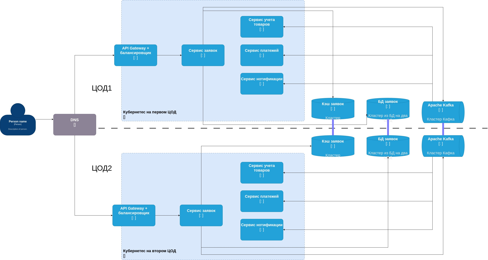

# Выбор архитектурного стиля
Функциональные требования к системе обработки заявок не будут сопряжены со сложной реализацией. В основном это технологические требования к сущности заявки и ее жизненному циклу.
Нефункциональные требования к данной системе являются стандартными для приложения с CRUDL и процессной обработкой.

В качестве архитектурного стиля предлагается использовать микросервисы, по причине их легкой масштабируемости, наблюдаемости. Также, при использовании данного подхода можно легко писать Stateless сервисы, что даст плюс к производительности и отказоустойчивости.

# Сбор требований
### Функциональные требования:
1. Пользователь должен иметь возможность создавать, редактировать и удалять заявки
2. Заявки должны иметь статусы и жизненный цикл
3. Должны быть предусмотрены роли модератора, исполнителя, администратора
4. Пользователь должен получать уведомления email/push/sms об изменении статуса
5. Заявки могут содержать в себе файлы - картинки/видео/pdf
6. Заявки должны экспортироваться в json
7. Заявки должны иметь секцию с комментариями
8. Заявки должны иметь систему оценки

### Производительность:
* Система должна обрабатывать не менее 1000 заявок в час без деградации производительности
* Среднее время отклика на пользовательский запрос не должно превышать 2 секунд\
### Отказоустойчивость:
* Система должна обеспечивать доступность на уровне 99.9%
* В случае сбоя одного из серверов система должна продолжать работу без потери данных
* Время восстановления после сбоя не должно превышать 5 минут
* Один раз в неделю должен производится бэкап базы данных на сервер в обособленном сегменте сети\
### Масштабируемость:
* Система должна поддерживать горизонтальное и вертикальное масштабирование при увеличении нагрузки
* Должна быть возможность увеличения числа серверов без модификации кода
### Наблюдаемость:
* Все критические операции должны логироваться с указанием времени и пользователя
* Должна быть реализована система мониторинга с отправкой уведомлений при критических сбоях

### SLI:
* Downtime системы, минут в год
* Время восстановления после сбоя
* Время отклика API по 95 перцентилю
* Количество заявок в ошибочном статусе в год
* Количество ответов с ошибкой 5** в год
* Годовая доля уведомлений, доставленных пользователю за 30 секунд и менее

### SLO:
* Downtime системы = 30 минут в год
* Время восстановления после сбоя = 30 мин
* Время отклика API по 95 перцентилю = 150ms
* Количество заявок в ошибочном статусе в год = 15
* Количество ответов с ошибкой 5** в год = 40
* Годовая доля уведомлений, доставленных пользователю за 30 секунд и менее = 97%

### SLA:
* Downtime системы = 60 минут в год
* Время восстановления после сбоя = 60 мин
* Время отклика API по 95 перцентилю = 200ms
* Количество заявок в ошибочном статусе в год = 30
* Количество ответов с ошибкой 5** в год = 80
* Годовая доля уведомлений, доставленных пользователю за 30 секунд и менее = 95%

# Применение шаблонов проектирования
Для того чтобы система была масштабируемой, отказоустойчивой и производительной применим комплекс мер и шаблонов:
* Организуем **два ЦОДа** с балансировкой на DNS, на которых будут располагаться кластеры с микросервисами.
* Код микросервисов напишем так, чтобы их было легко масштабировать, **Stateless** подход, использование сущностей-аггрегатов.
* Добавим в каждый кластер по одному **API-Gateway**. Воьзмём Envoy, он хорошо справляется с высокой нагрузкой. Балансировку между Цодами вынесем на уровень DNS.
* Для максимального быстрого ответа API будем использовать кэширование. Также оно позволит снизить нагрузку на БД. Будем использовать **распределенный кэш Redis Sentinel**. Стратегия кэширования будет write through, что немного скажется на производительности операций записи, однако позволит иметь стабильно актуальные, консистентные данные для чтения.
* Для обеспечения консистентности данных, а также дополнительной отказоустойчивости внедрим два паттерна: **Event Driven + Saga** хореографию. Используя хореографию у нас не будет единой точки отказа. Сага позволит обеспечить Eventual Consistency, а также работу с развалами транзакции. Используя Event Driven архитектуру добавляем отказоустойчивость за счет того что брокер сообщений сохранит все запросы и после восстановления приложение продолжит обработку заявок, ничего не потеряя. Также, Event Driven подход добавляет гибкость и расширяемость за счет того, что можно создавать новые отдельные обработчики событий.

# Результаты

Приведенная архитектурная схема будет хорошо справляться с нагрузками за счет:
* Stateless подхода при написании микросервисов
* Автоскейлинга в Kubernetes
* Распределение на двух географически разнесённых ЦОД
* Быстрота ответа будет обеспечеваться распределенным реплицируемым кэшем Redis Sentinel
* Синхронная репликация БД гарантирует консистентность и обеспечит отказоустойчивость
* Паттерн Сага позволяет сохранить Eventual Consistency, обеспечить отказоустойчивость