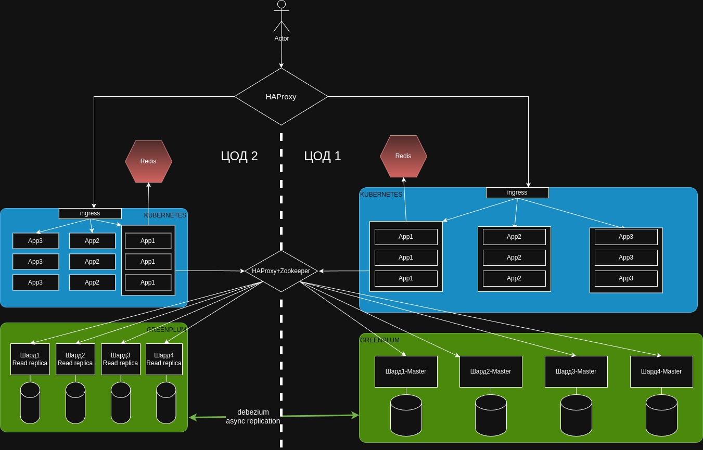

# Задание
Вам поручено разработать и оптимизировать архитектуру системы, которая должна обрабатывать запросы пользователей с минимальной задержкой и высокой доступностью. Система должна быть способна справляться с пиковыми нагрузками, обеспечивать отказоустойчивость и предоставлять стабильный уровень производительности. Вы также должны провести анализ производительности и предложить улучшения.
K
# 1. Масштабирование системы:
* Для данной системы выбор будет в пользу горизонтального масштабирования с элементами вертикального, т.к. к системе предъявляются довольно жесткие нефункциональные требования. Система разделена на масштабируемые компоненты: БД, приложения, кэш. Система развернута в двух ЦОД, над которыми стоит балансировщик с хэлсчеками. Приложения написаны в Stateless подходе, что позволяет их легко масштабировать в экосистеме Кубернетиса. Горизонтальное масштабирование позволит подготовиться к пиковому сезону, и в момент его наступления добавить ноды СУБД или приложений. После окончания high season можно убрать лишние ноды для экономии ресурсов. В период незначительного роста нагрузки можно накинуть серверам ресурсов чтобы избежать утечек памяти и тормозов со стороны приложений. 
* Если же мы выберем только вертикальное масштабирование, то система не обеспечит производительность в high season, равно как и отказоустойчивость, т.к. выход из строя сервера по причине огромного количества запросов повлечёт за собой падение узлов системы и в конечном счете она станет недоступна.

* Тот факт что мы используем горизонтальное масштабирование никак не связан с CAP теоремой, потому что система может быть как AP так и CP.
* Возьмем Greenplum. Мы выбрали размещение мастер нод на одном ЦОД, а реплик на чтение - на другом, причем шарды реплицируются асинхронно, что делает кластер Greenplum AP системой. При этом мы принимаем тот факт что данные на втором цоде могут устаревать в результате временного лага репликации, или split brain из-за сетевых проблем
* Возьмем Redis. Мы развернули по одному инстансу редиса в каждом кластере, тем самым мы обеспечили его доступность при падении ноды в другом цоде. Здесь мы жертвуем консистентностью и актуальностью кэша.
* Возьмем Kubernetes кластер. Классическая среда запуска и обслуживания микросервисов. На каждом цоде будет развернут отдельный кубернетес кластер, что обеспечит доступность системы если отвалится один из цодов. Так как в системе используется Greenplum с AP шардами и read репликами, то консистентность данных в этом случае не гарантируется, а значит систему можно отнести к AP

# 2. Обеспечение высокой доступности:
* Архитектурная схема представлена выше. Система развернута в двух связанных ЦОДах, над которыми стоит балансировщик HAProxy. При отказе одного из ЦОД, второй готов выдержать нагрузку х2. В каждом ЦОДе развернут Greenplum с асинхронной репликацией через Кафку+Debezium, что позволит системе работать при выходе из строя одного из узлов. Для того чтобы обеспечить failover переключение рид-реплик в мастер, используем связку HAProxy+Zookeeper.
* После восстановления упавшего ЦОДа, надо вручную синхронизировать шарды с помощью Postgres Logical Replication и вернуть их в Мастер режим. При этом консистентность данных соблюдаться не будет, мы осознанно делаем такой выбор.
* Redis развернут в каждом кластере независимо, что тоже повышает производительность системы при сбоях в обмен на согласованность данных в кэше.
* Рассмотрим пример отказа ЦОД-1, на котором находятся мастер шарды Greenplum. Zookeeper обнаруживает что Greenplum на первом ЦОДе недоступен и сообщает об этом в HAProxy, который перенаправляет все SQL запросы на ЦОД-2. Следующий шаг - сделать мастерами все рид-реплики на ЦОД-2. Для этого на ЦОД-2 работает failover скрипт, который мониторит состояние из Zookeper, и в случае недоступности ЦОД-1 делает мастерами шарды на ЦОД-2. Переключение завершено, теперь приложение пишет и читает из шардов на ЦОД-2.
* Восстановление после сбоя предполагается в ручном режиме. Допустим ЦОД-1 восстановился. Важно! До момента полной синхронизации данных на обоих ЦОД все SQL запросы должны идти только на ЦОД-2! Поэтому надо вручную настроить на HAProxy роутинг SQL-запросов только на ЦОД-2. Порядок действий следующий:
    1. Синхронизировать данные из ЦОД-2 в ЦОД-1 с помощью Postgres Logical Replication
    2. Потом настроить HAProxy роутинг трафика SQL запросов на оба ЦОДа
    3. Потом сделать шарды на ЦОД-2 read only репликами
    4. Готово. Изначальная конфигурация системы полностью восстановлена

# 3. Оптимизация производительности:
* Проведя анализ производительности, можно сказать что система хорошо себя показывает при высоких нагрузках на чтение, т.к. читать можно с шардов обоих ЦОД, а также использование Redis позволяет кэшировать тяжелые запросы и снижать нагрузку на БД, отдавая данные на фронт практически моментально. Горизонтальное масштабирование, HAProxy балансировщик - также дают плюсы к производительности.
* Узким местом в производительности данной системы является запись в БД только на ЦОД-1
* Направлениями для дальнейшей оптимизации могут быть:
     1. Оптимизация выполнения плана запросов
     2. Внедрение асинхронного логирования
     3. Сжатие данных и нахождение правильного баланса
     4. Использование batch-запросов и инсертов
     5. Внедрение асинхронного подхода в коде, для емких операций
     6. Использование Protobuf формата сериализации
* Профиль нагрузки API(пример)\
     RPS = 5000\
     Latency 50 перцентиль = 120мс\
     Latency 99 перцентиль = 500мс\
     Error rate = 0.1%\
     CPU Utilization = 90%\
     Memory Usage = 14GB из 16GB
* Улучшения
     1. Внедрить Rate Limiter
     2. Настроить autoscaling в Kubernetes
     3. Оптимизация кода, профилирование приложения, проанализировать GC-паузы, проверить на утечки памяти
     4. Сжатие ответов
     5. Переход на gRPC или реактивный стэк
     6. Внедрение асинхронной обработки (хотя бы частично)
# 4. Мониторинг и профилирование:
* Планируется поставить на мониторинг следующие метрики\
  RPS\
  Latency 50 перцентиль\
  Latency 99 перцентиль\
  Error rate\
  CPU Utilization\
  Memory Usage
* Метрики для мониторина БД\
  TPS (Transaction per second)\
  Disk I\O Ops\
  Replication Lab
* Микросеврисы\
  Количество запросов между сервисами\
  JavaScript bundle size\
  Среднее время загрузки страницы
* Инструменты сбора метрик:
  Prometheus, Grafana, Kubernetes, Nginx, HAProxy logs, Testing Results
* Сценарий анализа метрик производительности:\
  Любые метрики, где есть превышение оптимальных значений, беруться в анализ на проработку. После анализа предлагаются методы оптимизации 
  